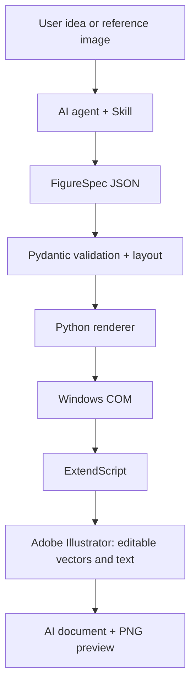

# Scientific Illustrator Agent

**Editable scientific figures in Adobe Illustrator, driven by structured specifications.**

Scientific Illustrator Agent connects AI agents to desktop Adobe Illustrator through Python, Windows COM and ExtendScript. An agent interprets a drawing request or reference image, creates a validated FigureSpec, and renders native vector objects with editable text.

**Status: experimental v0.1 — installable CLI Skill.** The core renderer has been exercised on Illustrator 2022. An MCP server is planned and is not included in this release.

## Capabilities

| Capability | Current support |
| --- | --- |
| Natural-language workflow design | Agent creates FigureSpec; horizontal and vertical layout |
| Simple reference reconstruction | Agent interprets image; normalized positions in FigureSpec |
| Editable graphics | Rectangles, rounded rectangles, ellipses, text, lines and arrows |
| Text integrity | One text block per label, including multiline labels; contents checked after rendering |
| Object identification | Named objects and an exported registry |
| Deliverables | Native AI document, PNG preview, specification and rendering trace |
| Incremental construction | Low-level JSX support; generic speed-controlled CLI not yet available |
| MCP, PDF/SVG export, automated visual QC | Planned |

The Python CLI does not contain a language model or an OCR service. Image interpretation and specification authoring are performed by the host agent. Complex illustration reconstruction and recovery of original chart data are outside the current FigureSpec renderer's scope.

## Architecture



The intermediate specification keeps automatic workflow placement in the layout engine. COM serves as the bridge to Illustrator; reusable JSX performs document operations.

## Requirements

- Windows 10/11 with an interactive desktop session.
- A licensed, locally installed Adobe Illustrator, with initial setup completed.
- Python 3.9 or later, pywin32, Pydantic and Pillow.
- An AI agent capable of reading this Skill and running local Python commands, when using natural-language input.

**Verified environment:** Illustrator 2022 (26.3.1), Python 3.9.13. Compatibility with Illustrator 2020 is a design target, not a tested guarantee. This project does not depend on Adobe's newer MCP integrations.

## Installation

### Python engine

```powershell
git clone https://github.com/LY2260789/scientific-illustrator-agent.git
cd scientific-illustrator-agent
python -m venv .venv
.\.venv\Scripts\python.exe -m pip install -r requirements.txt
```

### Agent Skill

The repository root contains [SKILL.md](SKILL.md) and its runtime resources. Install the **whole repository**, not only the Markdown file.

In Codex, ask:

> Install the Skill from https://github.com/LY2260789/scientific-illustrator-agent, using the repository root as the skill directory.

For manual installation, place the repository contents in `~/.codex/skills/scientific-illustrator-agent/`, then install the Python dependencies there. Other agents need a compatible Skill loader and permission to execute local commands. This is not an MCP configuration; there is no MCP server command in v0.1.

## Quick start

Run the following from the repository root using the virtual environment created above.

### Check Illustrator

```powershell
.\.venv\Scripts\python.exe examples/hello_illustrator.py --connect-only
```

Expected output includes the Illustrator version and `Illustrator connected successfully`. COM may launch Illustrator automatically; bringing its window to the foreground is not guaranteed.

### Create a first document

```powershell
.\.venv\Scripts\python.exe examples/hello_illustrator.py --output outputs/hello.ai
```

Creates a new document with a blue rounded rectangle, editable text and a line, then saves an AI file.

### Render a scientific workflow

```powershell
.\.venv\Scripts\python.exe examples/render_spec.py examples/specs/pm25_workflow.json --validate-only
.\.venv\Scripts\python.exe examples/render_spec.py examples/specs/pm25_workflow.json --output outputs/workflow.ai
```

Use a new output name for subsequent runs: existing outputs are intentionally not overwritten.

### Use natural language

Example requests for an agent with this Skill installed:

> Create a vertical workflow in Illustrator: data input, preprocessing, analysis, evaluation and results. Keep each label editable.

> Reconstruct this simple reference diagram with editable shapes and one text frame per original text block.

The agent should read the schema, write and validate a FigureSpec, render it, and inspect the PNG preview. See [input modes](docs/input_modes.md), [the schema](src/models/figure_spec.py), and [example specifications](examples/specs).

## Outputs and document handling

Each FigureSpec render produces:

- `.ai`: native Illustrator document.
- `.png`: preview exported from Illustrator.
- `.spec.json`: the input specification.
- `.registry.json`: observed object names, text counts and warnings.
- `.jsx.log`: rendering trace for troubleshooting.

Rendering creates a new document and checks text contents and object counts. It does not adopt the user's existing document for editing. There is no transactional rollback: a failed operation can leave a partial new document or partial output files for inspection. The renderer does not automatically close Illustrator or retry failed mutations.

Reference artwork, private research examples, output files and runtime logs are excluded from this repository.

## Development and validation

```powershell
.\.venv\Scripts\python.exe -m unittest discover -s tests
```

The current suite contains 14 offline tests covering the COM wrapper, specification validation and layout. Passing these tests does not verify the installed Illustrator runtime. Use the connection and rendering commands above for desktop integration checks.

```text
SKILL.md              Agent workflow and operational guidance
src/illustrator/      COM bridge, JSX builder and drawing scripts
src/models/           FigureSpec validation
src/layout/           Layout computation
src/renderer/         Document rendering and output verification
examples/             Connection demo and generic specifications
tests/                Offline tests and manual connection entry point
docs/                 Input modes and development notes
```

## Troubleshooting

| Symptom | Suggested check |
| --- | --- |
| Dispatch fails or COM is not registered | Confirm local Illustrator installation; complete first-launch dialogs; repair the installation if necessary. |
| Illustrator cannot start / `0x80080005` | Try a normal interactive desktop terminal and inspect pending application dialogs; a restricted execution environment can block desktop COM. |
| COM reports Illustrator is busy | Finish modal dialogs and wait for the application to become idle before a new operation. |
| DoJavaScript or JSX error | Inspect the exception and rendering trace; ExtendScript uses legacy syntax and API availability varies by version. |
| Native application error / `0x80010105` | Preserve any open work, recover Illustrator, then run the connection check before attempting a new render. |
| Missing characters | Choose an installed font that supports the required language; keep JSON and logs encoded as UTF-8. |
| Save or export fails | Check the output directory, `.ai` extension and existing files; quote paths containing spaces. |

A native crash occurred during early text-property experiments. The simplified renderer subsequently passed local integration checks, but the root cause was not established. The project remains experimental.

## Roadmap

- Structured MCP tools backed by the existing renderer.
- Generic progressive rendering and natural-language speed presets.
- Broader scientific primitives and graph routing.
- Additional export formats and object editing operations.
- Geometry checks and a preview-driven visual review loop.

## Contributing

Issues with minimal specifications and reproducible steps are welcome. Include Windows, Python and Illustrator versions, expected behavior and relevant error messages. Remove confidential research content and credentials before sharing logs or reference files.

No open-source license has been selected yet. Public repository visibility does not itself grant a license to redistribute or commercially reuse the code.

## References

- [Adobe Illustrator scripting documentation](https://helpx.adobe.com/illustrator/using/scripting.html)
- [Skill entry point](SKILL.md)
- [Input modes and text preservation](docs/input_modes.md)
